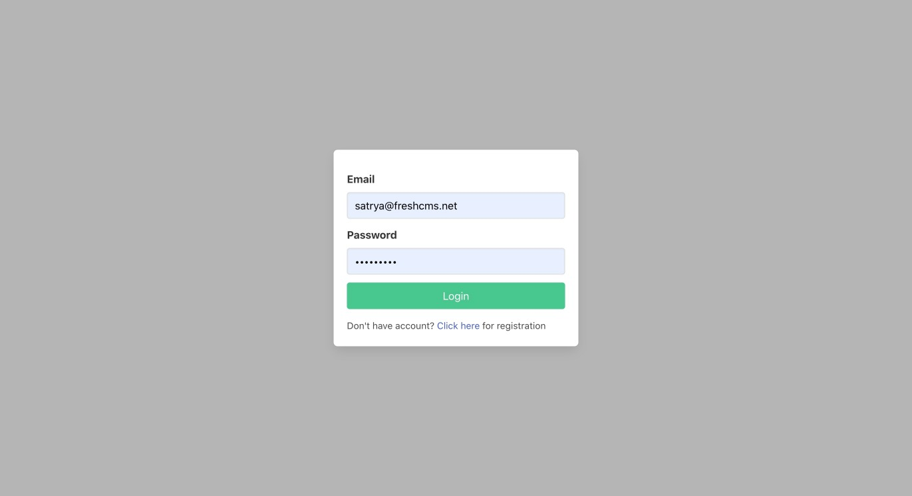
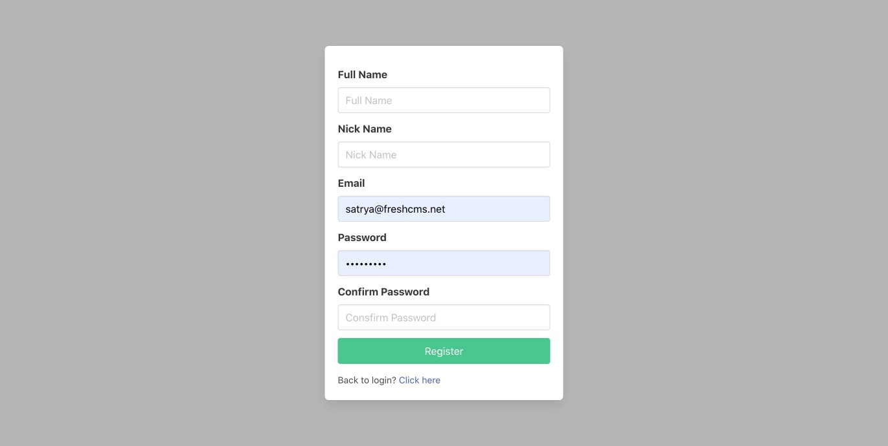
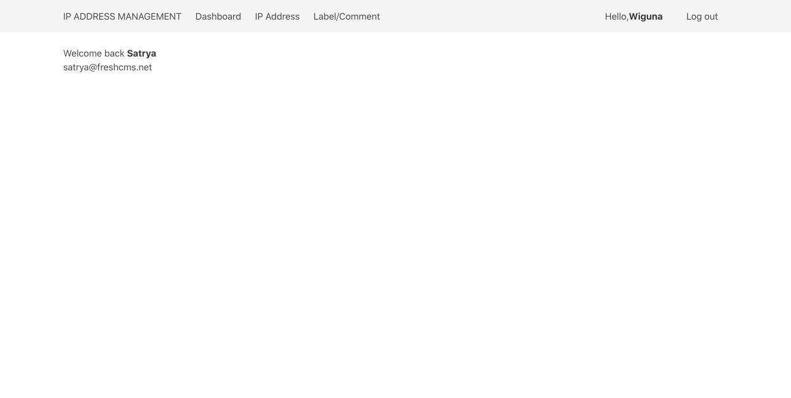
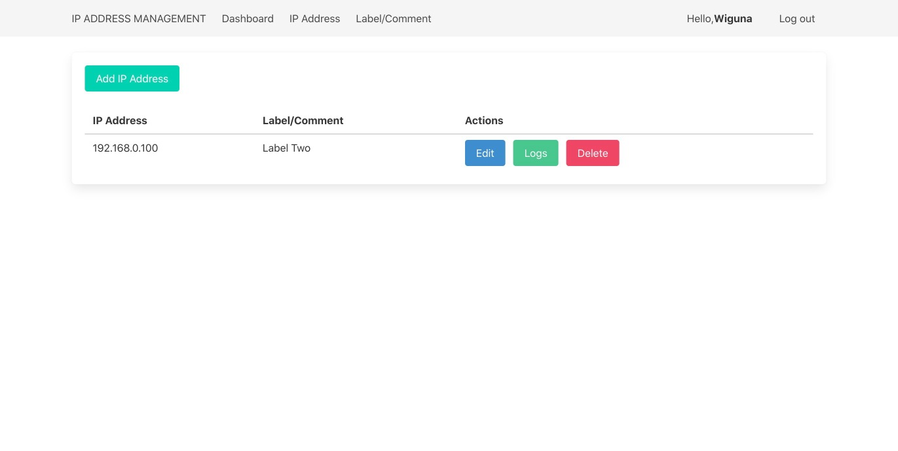
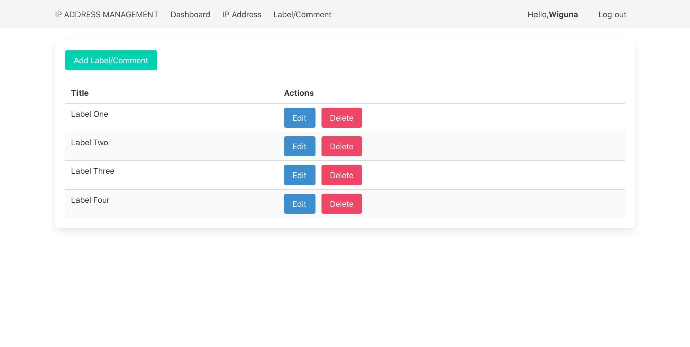

# ip-management-api

## Project setup
```
git clone https://github.com/satryawiguna/ip-address-management-app.git

cd into root project folder

run docker-compose up -d
```

## Configuration
Create a .env file then adjust some configuration inside
```
REACT_APP_BASE_API_URL=http://localhost:81/api/
REACT_APP_FINGER_PRINT=7b347d54b1bb31c4ff83180cfc0bdbc8aa6a22c9

```

## Attachment











